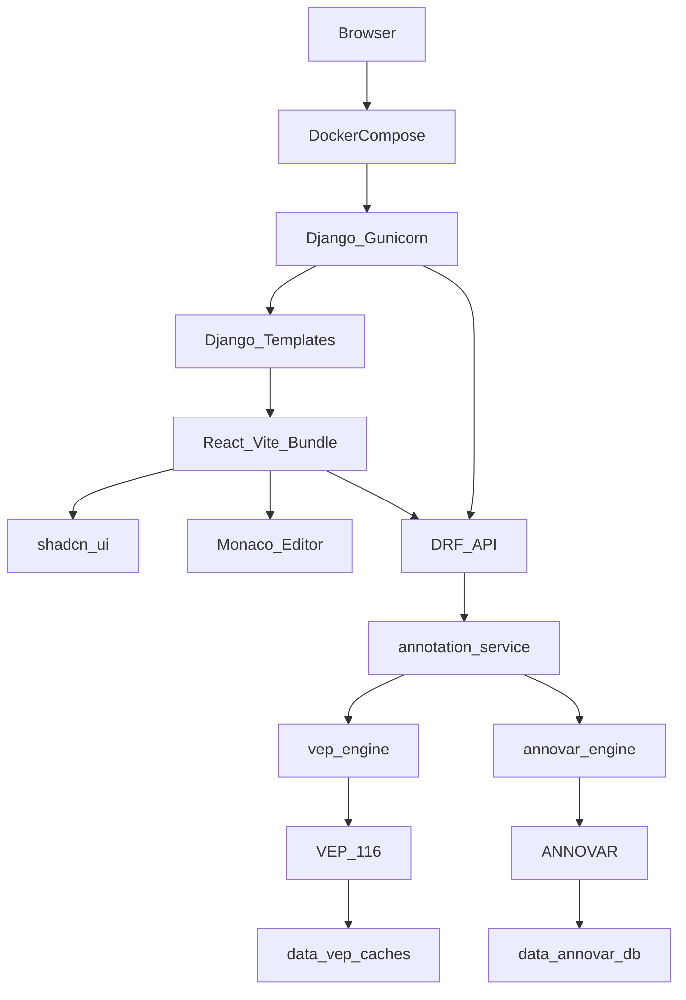

# 在线生信工具架构整合规划（修订版）

> 修订依据：当前工作区仅有 1 个 FastAPI 文件（约 285 行）、2 个 CLI Docker 沙箱、约 74GB reference data；无 Git、无前端、无测试、无统一入口。  
> 产品目标：统一网页入口 + REST API；VEP 与 ANNOVAR 最终同等接入。  
> **技术栈定版**：后端 **Django + Django REST framework**；部署 **Docker Compose**；前端 **Django Template 壳 + React（Vite 产出静态资源）**，UI 风格采用 **shadcn/ui**，变异/脚本编辑采用 **Monaco Editor**；不建独立 SPA 部署仓库，页面路由仍归 Django。  
> **落地顺序**：先止血与数据治理 → 用 Django/DRF 重建权威入口并迁入 VEP → Template + shadcn/Monaco 工具页 → 再扩展 ANNOVAR。  
> **实施进度（功能分支 `refactor/architecture-django-drf`）**  
> - 已完成：Git 基线、Django+DRF+Compose、VEP/ANNOVAR、shadcn Sidebar 全站布局、Monaco VCF 输入、**阶段 4 生产硬化**（API Key、限流、request_id 日志、ANNOVAR 授权闸门、部署文档）、legacy 重复 tar 清理。  
> - UI 约定：默认使用 shadcn 官方 neutral 主题；无用户明确要求不做个性化换肤。  
> - 仍可选：彻底删除 `legacy/online-vep` 解压 cache（待 116/GRCh38 验收）、SSO、异步作业（阶段 5）。

---

## 1. 对原计划的评价

### 仍然成立

- 诊断准确：VEP 双轨、数据与代码混放、凭证日志、无工程底座、API/CLI 能力不对等。
- 原则正确：先止血、再统一契约、后扩展；不做 K8s/插件平台/独立 SPA 仓库。
- 删并方向正确：legacy `online-vep/` 应收编后删除，reference data 不进 Git。

### 技术栈变更说明

| 原设想 | 现定版 | 原因 |
|--------|--------|------|
| FastAPI + 极简 SSR | **Django + DRF** | 统一 Web 入口、后台能力、鉴权/会话与模板体系更完整，便于后续加页面与管理能力 |
| 纯 CDN React / 无构建 | **Template 壳 + Vite 构建的 React 挂载区** | **shadcn/ui** 依赖 Tailwind + 组件源码拷贝， practically 需要轻量前端构建；产物由 Django `collectstatic` 托管 |
| 朴素表单 UI | **shadcn/ui + Monaco Editor** | 统一现代组件风格；变异列表 / VCF 片段用 Monaco 编辑，体验接近 IDE |
| `asyncio.to_thread` 模型 | **同步 Django + gunicorn worker** | 注释任务本就是阻塞 CLI；用 worker 数 + 进程级并发锁控制即可 |
| 就地改 FastAPI 再搬家 | **新建 Django 项目，逻辑从 FastAPI 迁入** | 框架切换不宜在旧单文件上硬拧；归一化/解析等纯函数可直接复用 |

### 相对当前体量仍需克制

| 点 | 修订 |
|----|------|
| 过早 `packages/` 多包 | Django 单项目 + `apps`（如 `annotations`、`portal`）即可 |
| Day 1 双引擎公共 Serializer | 先 VEP Serializer；ANNOVAR 落地后再抽公共字段 |
| 独立前端部署 / 客户端路由 SPA | **不做**；仅仓库内 `frontend/` 用 Vite 构建 widget，Django Template 挂载；不做 React Router 主导整站 |
| 把全部 shadcn 组件库一次性拷入 | 按页面需要逐步 `add` 组件，避免空壳膨胀 |
| SSO / Celery 首版 | API Key 或 Django 登录即可；异步作业等真实负载再上 |

---

## 2. 现状概览

```
online-biotool/                          # 无 Git / 无根 README（仅有本计划）
├── ARCHITECTURE_PLAN.md                 # 本文件
├── online-tool/online-vep/              # ★ 当前唯一在线服务（FastAPI + VEP 116 + GRCh37）
│   ├── api/main.py                      # 待迁入 Django 的业务逻辑来源
│   ├── Dockerfile / docker-compose.yml
│   └── scripts/download_cache.sh
├── online-vep/                          # 遗留 CLI（VEP 115.2 + GRCh38，~49GB）
└── online-annovar/                      # ANNOVAR CLI 沙箱（无 API）
```

| 维度 | 现状 | 目标 |
|------|------|------|
| HTTP 服务 | FastAPI 三端点 | Django + DRF 统一 API + Template 页面 |
| 前端 | 无 | Template 布局 + React（shadcn/ui + Monaco）交互区 |
| 启动方式 | 单服务 compose | 根目录 Docker Compose 一键启动 |
| 引擎 | 仅 VEP 在线 | VEP → 再 ANNOVAR，同等 API 契约 |

---

## 3. 问题清单

### P0 — 立即处理

1. **凭证泄露**：`online-annovar/humandb/wget-log*` → 先轮换凭证，再删日志。
2. **无忽略规则**：`git init` 前必须有根 `.gitignore`（排除 cache / vep_data / humandb / `*.tar.gz` / wget-log / `__pycache__`）。
3. **虚假能力**：当前 API 接受 GRCh38 但只有 GRCh37 cache。

### P1 — 架构与可维护性

4. VEP 双轨（115/GRCh38 CLI vs 116/GRCh37 API）。
5. FastAPI 单文件上帝对象；框架将整体替换为 Django，但纯逻辑应抽成可测模块迁入。
6. 阻塞 CLI 无并发上限；Django 下用 worker + 进程锁/文件锁限制同时运行的 VEP/ANNOVAR 数。
7. 错误语义分裂（200 + `success=false` vs 真 4xx/5xx）→ DRF 统一用异常 + 状态码。
8. ANNOVAR 未服务化；授权与镜像路径未澄清。
9. 数据与代码混放（~74GB）。
10. 无测试、lint、依赖锁定、文档、可观测性。

---

## 4. 合并与删除建议

### 可直接删除（阶段 0）

| 路径 | 原因 |
|------|------|
| `online-vep/*.tar.gz.1`、`wget-log` | 下载残留 |
| `online-annovar/humandb/wget-log*` | 轮换凭证后删除 |
| `online-tool/online-vep/api/__pycache__/` | 生成物 |
| FastAPI 中未使用的 `HGVSEntry` | 迁入时直接丢弃 |

### 验证后删除（阶段 2–3）

| 路径 | 条件 |
|------|------|
| 重复的 `homo_sapiens_vep_115_GRCh38.tar.gz`（~24GB） | 解压 cache 可独立使用后 |
| 整个 `online-vep/` | GRCh38 已由 Django 侧 VEP 116 覆盖，且无外部依赖 |
| 整个 `online-tool/online-vep/`（FastAPI 栈） | Django 服务接替 `/annotate` 能力并稳定后 |
| ANNOVAR 可再生中间产物 | 保留脱敏 VCF + golden 输出进 `fixtures/` |

### 合并保留

- VEP **116** 为唯一基线；GRCh37/38 各套 cache + `reference-manifest.yaml`。
- ANNOVAR 作为第二引擎适配器（授权通过后）。
- 从 `main.py` 迁出：`normalize_variant`、VEP JSON 解析、输入格式约定。
- `download_cache.sh` 扩展为按 assembly 下载 + checksum。

---

## 5. 目标技术架构（定版）

### 5.1 技术选型

| 层 | 选型 | 说明 |
|----|------|------|
| Web / 业务 | **Django** | 页面路由、设置、静态资源、可选 Admin、会话登录 |
| API | **Django REST framework** | `/api/v1/*` Serializer、ViewSet/APIView、统一错误与权限 |
| 前端壳 | **Django Template** | 布局、CSRF、注入配置（API 基址、引擎列表 bootstrap） |
| 前端交互 | **React + Vite** | 工具页挂载区：表单、结果表、引擎切换；构建产物进 Django static |
| UI 风格 | **shadcn/ui**（Tailwind + Radix） | 按钮、表单、Select、Dialog、Table、Toast 等按需引入，统一视觉与无障碍基础 |
| 编辑器 | **Monaco Editor**（`@monaco-editor/react`） | 变异列表 / 小段 VCF / 结果只读查看；语法高亮与大文本编辑 |
| 进程 | **gunicorn**（同步 worker） | 阻塞注释任务友好；限制 worker 与引擎并发 |
| 编排 | **Docker Compose** | `web`（Django）+ 数据卷；镜像构建阶段跑 `npm run build` |
| 数据 | 外部卷 `DATA_ROOT` | 不进 Git |

**前端边界（Template + React，不是独立 SPA）：**

- Template 负责整页骨架、导航与首屏配置（`json_script` / `window.__BOOTSTRAP__`）。
- React 只挂载工具页主交互区（`#annotate-root`），调用 DRF，用 **shadcn/ui** 渲染控件与结果表。
- **Monaco** 用于输入区（多行变异 / VCF 片段）及可选的结果只读面板；注意按需加载 worker，避免首屏体积膨胀。
- 路由仍以 Django URL 为准；不做 React Router 主导的多页应用。
- **为何不再坚持纯 CDN：** shadcn/ui 以源码组件 + Tailwind 为主，CDN 拼装成本高且难维护；因此采用仓库内 `frontend/` + Vite，**部署仍只有 Django 一个入口**。

**shadcn/ui 与 Monaco 约定：**

- 主题：与生物信息工具气质一致的中性色 + 清晰对比（避免默认「AI 紫」堆砌）；亮色优先，暗色可选。
- 组件按需 `shadcn add`，禁止一次性导入全套。
- Monaco 与 shadcn 表单并存：短选项用 shadcn Select/Radio；长文本/多行变异用 Monaco。
- 构建：`frontend/` → `apps/portal/static/portal/dist/`（或项目 `static/dist/`），Django `` 引用；Compose 构建 web 镜像时执行前端 build。

### 5.2 逻辑架构



### 5.3 目标目录

```
online-biotool/
├── README.md
├── ARCHITECTURE_PLAN.md
├── .gitignore
├── docker-compose.yml              # 一键启动 web + 挂载 data/
├── requirements.txt                # Django / djangorestframework / gunicorn / ...
├── requirements-dev.txt
├── reference-manifest.yaml
├── manage.py
├── config/                         # Django project settings / urls / wsgi
│   ├── settings.py
│   ├── urls.py
│   └── wsgi.py
├── apps/
│   ├── portal/                     # Template 页面视图（首页、注释工具页）
│   │   ├── templates/portal/
│   │   ├── static/portal/dist/     # Vite 构建产物（可 gitignore，CI/镜像内生成）
│   │   └── views.py
│   └── annotations/                # DRF API + 引擎适配
│       ├── api/                    # views / serializers / urls
│       ├── services/               # 编排、并发限制、错误映射
│       ├── engines/                # vep.py / annovar.py / base.py
│       ├── normalize.py            # 从 FastAPI 迁入
│       └── tests/
├── frontend/                       # React + Vite + Tailwind + shadcn/ui + Monaco
│   ├── package.json
│   ├── vite.config.ts
│   ├── components.json             # shadcn 配置
│   ├── src/
│   │   ├── main.tsx                # 挂载到 Django 提供的 root
│   │   ├── pages/AnnotateApp.tsx   # 工具页主组件
│   │   ├── components/ui/          # shadcn 生成组件
│   │   └── components/editors/     # Monaco 封装（VariantEditor 等）
│   └── ...
├── scripts/
│   ├── download_vep_cache.sh
│   └── prepare_annovar_db.sh
├── fixtures/
├── Dockerfile                      # multi-stage: Node build frontend → Python/Django 运行镜像
└── data/                           # 不进 Git（见 data/README.md）
    ├── vep/homo_sapiens_merged/116_GRCh37/
    ├── vep/homo_sapiens_merged/116_GRCh38/
    └── annovar/humandb/            # hg19_* + hg38_* 同目录
```

### 5.4 Docker Compose 形态（原则）

- **`web`**：Django + gunicorn，对外唯一端口（如 `8000` 或现网约定端口）。
- **数据卷**：`./data:/data:ro`（或读写临时目录另挂）。
- **引擎运行方式（二选一，阶段 1 定案）**  
  - **A（推荐起步）**：web 镜像基于/旁路安装 VEP，Django 直接 `subprocess`（与现 FastAPI 相同，迁入成本最低）。  
  - **B**：`vep-runner` / `annovar-runner` 为内部 sidecar，Django 只调内部 HTTP——隔离更好，运维更重，放到 ANNOVAR 接入后再评估。
- 不把 24GB cache 打进镜像；用 volume + `reference-manifest.yaml`。

### 5.5 API 契约（DRF）

| 端点 | 用途 |
|------|------|
| `GET /health/live` | 进程存活（可非 DRF 简单 view） |
| `GET /health/ready` | 引擎与 data readiness |
| `GET /api/v1/engines/` | 引擎列表、版本、assembly、就绪状态 |
| `POST /api/v1/annotations/` | `engine=vep\|annovar\|both` + `variants` + `assembly` |
| `GET /` / `GET /tools/annotate/` | Template 页面；页内 React 调上述 API |

错误：校验失败 400、未就绪 503、引擎失败 502、超时 504；**禁止**业务失败却 HTTP 200。

权限（阶段 4）：`IsAuthenticated` 或 API Key；页面用 Django session，React 请求带 CSRF。

运行模型：gunicorn 同步 worker + **全局/进程内信号量**限制同时跑的注释任务；首版不上 Celery。

---

## 6. 分阶段计划

### 阶段 0：止血与基线（1–2 天）

- 轮换凭证；删 `wget-log*` 与下载垃圾；根 `.gitignore` + README。
- 记录现有 FastAPI 行为与样例请求，作为迁移验收基准。
- 确认 ANNOVAR 授权、是否有调用方依赖 `:8093`。
- **退出**：敏感物清理完毕；忽略规则就绪；迁移 checklist 明确。

### 阶段 1：Django + DRF 权威入口 + 迁入 VEP（约 1 周）

- 新建 Django 项目骨架（`config/` + `apps/annotations` + `apps/portal`）。
- 迁入归一化与 VEP runner；DRF 实现 `engines` / `annotations`；修正 assembly 与错误码。
- 根目录 `Dockerfile` + `docker-compose.yml` 可启动；挂载现有 GRCh37 cache。
- `portal` 先提供占位 Template（可暂无完整 UI）。
- 单元测试覆盖 normalize / parser；API 测试用 DRF test client + mock subprocess。
- **退出**：`docker compose up` 后 GRCh37 注释可用，行为对齐或优于旧 FastAPI；旧服务可并行保留但不再作为权威。
- **风险**：镜像体积（含 VEP）偏大 → 文档化构建时间与分层缓存；先复用官方 VEP 基镜像思路。

### 阶段 2：VEP 单轨 + 数据约定 + 下线 FastAPI/legacy（3–5 天）

- GRCh38 cache（116）接入 + manifest readiness。
- 删除重复 tar / 确认后删 `online-vep/`；Django 稳定后删 `online-tool/online-vep` FastAPI 栈。
- 目录与文档只描述 Compose 一种启动方式。
- **退出**：仅 Django 路径；双 assembly 就绪状态真实可信。

### 阶段 3：Template + shadcn/ui + Monaco 工具页 + ANNOVAR（1–2 周）

- 初始化 `frontend/`（Vite + React + Tailwind + shadcn/ui）；按需添加 Button、Select、Card、Table、Toast、Dialog 等。
- **Monaco Editor** 作为变异输入主控件（支持多行 `chr:pos ref>alt` / 小 VCF）；结果区用 shadcn Table，可选 Monaco 只读查看原始 JSON。
- Django Template 挂载构建产物；`docker compose build` 含前端 multi-stage。
- 实现 `engines/annovar.py`；公共字段进主 Serializer，差异进 `details`。
- **退出**：浏览器内可完成 VEP/ANNOVAR 主路径（shadcn 风格页面 + Monaco 输入），无需进容器敲命令。
- **风险**：Monaco 包体较大 → 路由级/组件级懒加载；shadcn 主题与 Django Admin 视觉分离，不强行统一 Admin。

### 阶段 4：生产硬化（3–5 天）

- 登录或 API Key、CSRF、限流/批量上限、结构化日志、`DEBUG=False`、静态资源与反代文档。
- **退出**：内网可常驻；无鉴权不可写。

### 阶段 5：异步（可选）

- 仅当超时/批处理/并发证明同步模型不够时，再上 `202 + job_id`（Django + DB 状态或 Celery）。

---

## 7. 明确不建议

- 继续维护 FastAPI 与 Django 双权威入口。
- 首版独立 React SPA 部署仓库、客户端路由主导整站、GraphQL。
- 为迁就「纯 CDN」而放弃 shadcn，或反过来把整站做成 Next.js 与 Django 抢路由。
- VEP/ANNOVAR 打进同一「逻辑混乱」的巨型业务镜像却不分离适配器代码（镜像可同基，**代码必须分 engines**）。
- 首版 Celery/K8s/微前端。
- 用目录非空冒充 cache readiness。
- ANNOVAR 授权未清就对外服务。

---

## 8. 一句话执行顺序

**清凭证与垃圾 → 用 Django + DRF + Compose 重建入口并迁入 VEP → 下线 FastAPI/legacy → Template + Vite/React（shadcn/ui + Monaco）做工具页并接 ANNOVAR → 按负载再考虑异步。**
